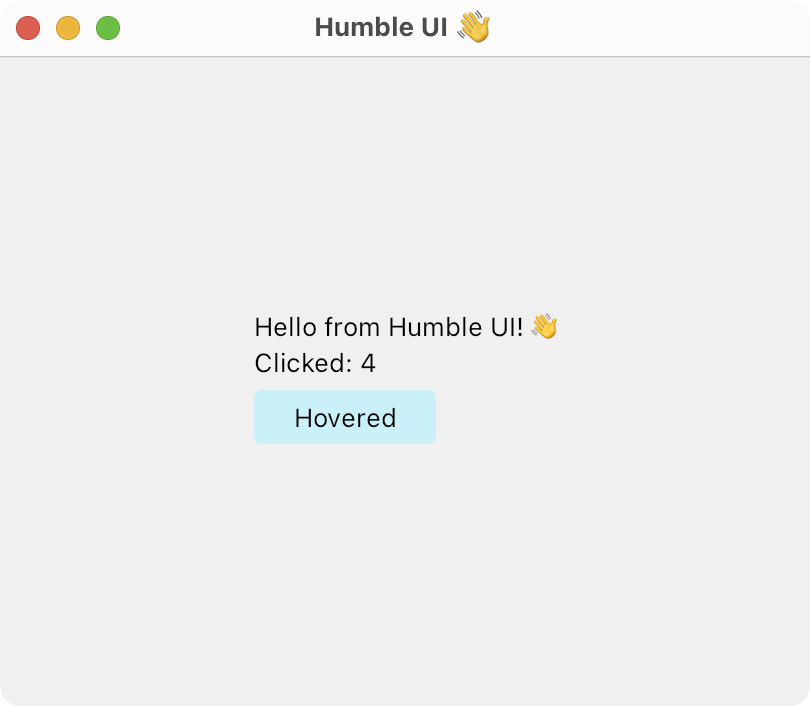

# Clojure Desktop UI framework

<p align="center">
  
</p>

## Development

Run nREPL server:

```
./script/run.py
```

See `(comment)` forms in [user.clj](https://github.com/HumbleUI/HumbleUI/tree/main/dev/user.clj).

## Examples



```
(defonce *clicks (atom 0))

(def app
  (ui/dynamic ctx [scale (:scale ctx)]
    (let [font-default        (Font. face-default (float (* 13 scale)))
          leading             (.getCapHeight (.getMetrics font-default))
          fill-text           (doto (Paint.) (.setColor (unchecked-int 0xFF000000)))
          fill-button-normal  (doto (Paint.) (.setColor (unchecked-int 0xFFade8f4)))
          fill-button-hovered (doto (Paint.) (.setColor (unchecked-int 0xFFcaf0f8)))
          fill-button-active  (doto (Paint.) (.setColor (unchecked-int 0xFF48cae4)))]
      (ui/valign 0.5
        (ui/halign 0.5
          (ui/column
            (ui/label "Hello from Humble UI! 👋" font-default fill-text)
            (ui/gap 0 leading)
            (ui/dynamic _ [clicks @*clicks]
              (ui/label (str "Clicked: " clicks) font-default fill-text))
            (ui/gap 0 leading)
            (ui/clickable
              #(swap! *clicks inc)
              (ui/clip-rrect (* scale 4)
                (ui/dynamic ctx [active?  (:hui/active? ctx)
                                 hovered? (:hui/hovered? ctx)]
                  (let [[label fill] (cond
                                       active?  ["Active"    fill-button-active]
                                       hovered? ["Hovered"   fill-button-hovered]
                                       :else    ["Unpressed" fill-button-normal])]
                    (ui/fill fill
                      (ui/padding (* scale 20) leading
                        (ui/label label font-default fill-text)))))))))))))
```