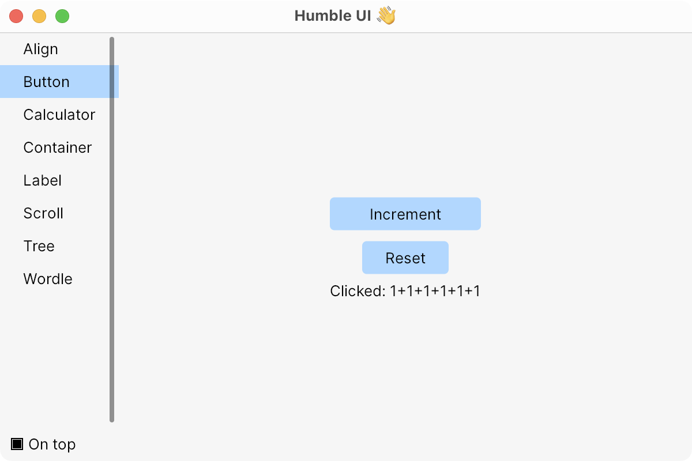
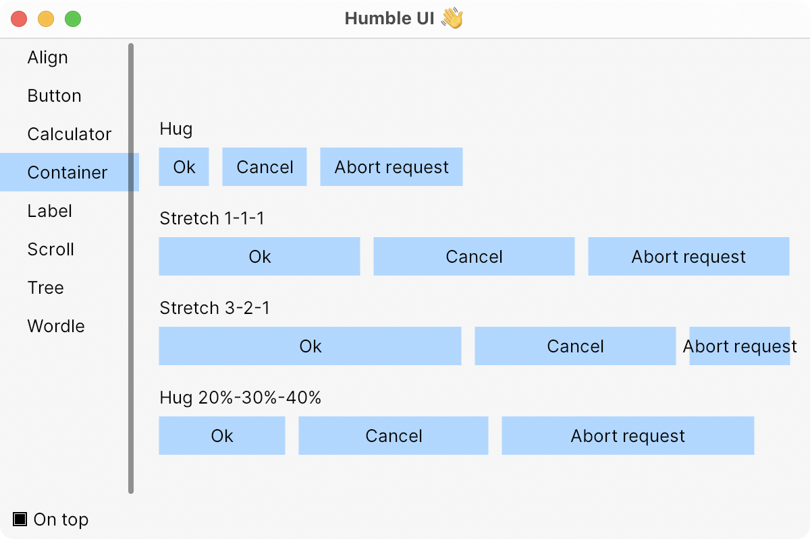
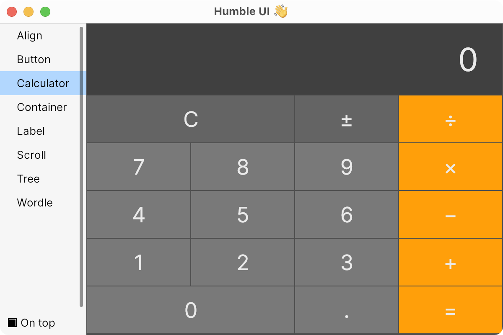
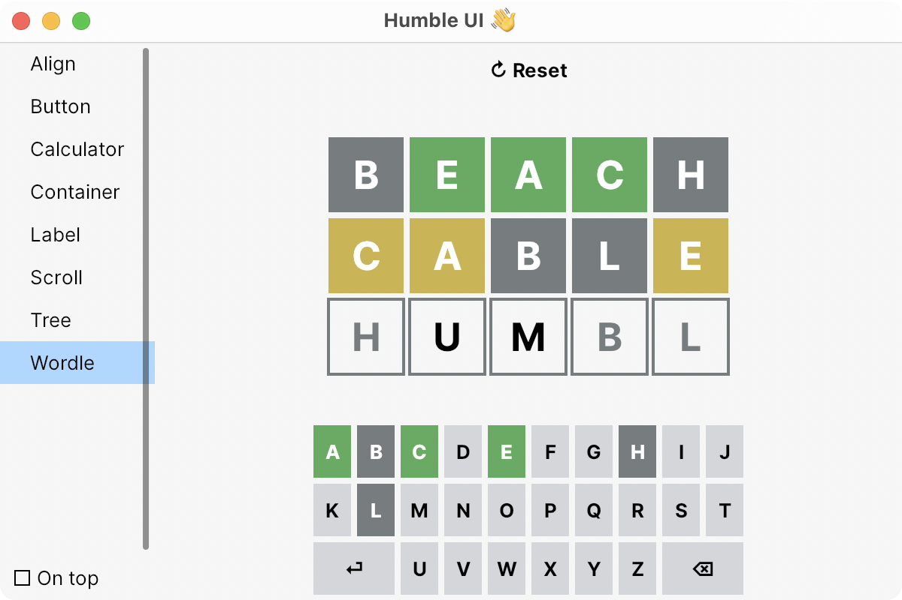

<p align="center">
  
</p>

> “When you design a new user interface, you have to start off humbly”

_— Steve Jobs presenting Aqua_

Humble UI is a desktop UI framework for Clojure. No Electron. No JavaScript. Only JVM and native code.

## Goal

- A way to build high-quality desktop UIs
- Build better apps that’s possible with web now, while staying cross-platform
- Build them faster in Clojure

## Motivation

- Create desktop apps in Clojure
- Electron is a great landmark
    - People prefer native apps to web apps
        - Normal shortcuts, icon, its own window, file system access, notifications, OS integrations
    - Developing real native apps is expensive
    - JavaScript + Chrome is have a huge overhead, can be slow
- Java has “UI curse”
    - Previous attempts were cumbersome for user
    - Mimicking native look and feel didn’t worked
    - Looked bad
- Time of declarative UIs is now
    - React
    - Flutter
    - SwiftUI
    - Jetpack Compose
- Web + Electron cleared the way for non-native look and feel
    - Write once, run everywhere is no longer rejected by users
    - Even native apps have many custom UI elements
- Flutter proved new UI stack is a feasible task
- Clojure is the best language for UI development
    - Performant enough to not noticeably lag
    - Access to full power of your computer (multithreaded)
    - REPL + interactive development == instant feedback loop
    - Proven itself great in CLJS world, can do the same on desktop

## How is it going to be different

- No goal to look native, aim for web look (write once, run everywhere)
- Embrace platform differences in OS integration
- Declarative UI API is much more pleasant to work with (+plays well with FP)
- Expose low-level APIs along with high-level API
    - People can solve non-trivial problems in their own way, without hacks
- Superpowers of Clojure

## Architecture

- Leverage Skia via [Skija](https://github.com/HumbleUI/Skija) for high-performance GPU-accelerated graphics
- [JWM](https://github.com/HumbleUI/JWM) (Java Window Manager) for OS integration (simple, common ground, embrace the differences)

## Status

Work in progress. No docs, and everything changes every day.

## Resources

Slack:

- #humbleui on Clojurians Slack ([invite here](http://clojurians.net/))

Posts:

- [Thoughts on Clojure UI framework](https://tonsky.me/blog/clojure-ui/)
- [Humble Chronicles: Decomposition](https://tonsky.me/blog/humble-decomposition/)
- [Humble Chronicles: The Layout](https://tonsky.me/blog/humble-layout/)
- [Humble Chronicles: Developer Experience](https://tonsky.me/blog/humble-dx/)

Videos:

- [Wordle in Clojure with Humble UI](https://www.youtube.com/watch?v=qSswvHrVnvo)

## Development

Run nREPL server:

```
./script/run.py
```

See `(comment)` forms in [user.clj](https://github.com/HumbleUI/HumbleUI/tree/main/dev/user.clj).

## Examples

|||
|---|---|
|||

```clj
(ns examples.label
  (:require
    [io.github.humbleui.ui :as ui]))

(def ui
  (ui/valign 0.5
    (ui/halign 0.5
      (ui/label "Hello from Humble UI! 👋"))))
```
